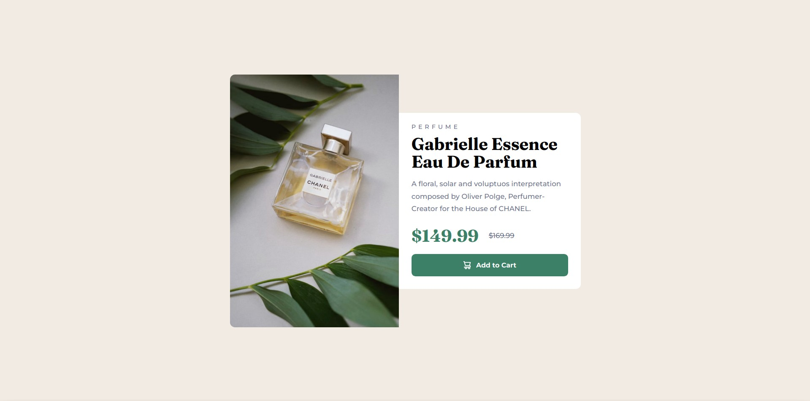
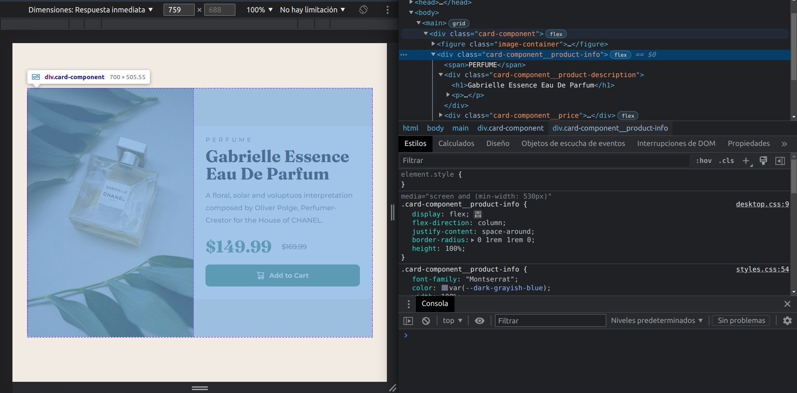

# Frontend Mentor - Product preview card component attempt

This is my attempt to the [Product preview card component challenge on Frontend Mentor](https://www.frontendmentor.io/challenges/product-preview-card-component-GO7UmttRfa). This website has a lot of challenges to practice Frontend, check it out.

If you are seeing this because of **Frontend Mentor**, some help with current issues will be helpful and appreciated, I've recently started to learn Frontend Development.

## Table of contents

- [Overview](#overview)
  - [Objective](#objective)
  - [Screenshot](#screenshot)
  - [Links](#links)
- [My process](#my-process)
  - [Built with](#built-with)
  - [Current main issue](#current-main-issue)
  - [Useful resources](#useful-resources)
- [Author](#author)
- [Acknowledgments](#acknowledgments)

## Overview

### Objective

Practicing layout, media queries and responsive design with
this small project.

### Screenshot

***Desktop Design to be achieved***


***My Design with current issues***


### Links

- Solution URL: <https://ea-gadgeter.github.io/Card-Component/>
- Live Site URL: <https://github.com/EA-Gadgeter/Card-Component/>

## My process

### Built with

- Semantic HTML5 markup
- CSS following BEM naming convetion
- Flexbox
- Mobile-first workflow

### Current Main Issue

I've finished mobile version, but im sure they can be improved, so feedback is welcome.

Currently I'm having trouble with the desktop version, how you've seen in the image above, product-info height isn't the same as the image height. I thought that using height: 100% in card-component__product-info should work, but for some reason it doesn't fits card-component's height.

Here are some aditional screenshots and the CSS code desktop version I currently have, please don't forget to check all code in the respository.



```css
.card-component {
    flex-direction: row;
}

.card-component .card-component__image {
    border-radius: 1rem 0 0 1rem;
}

.card-component__product-info{
    display: flex;
    flex-direction: column;
    justify-content: space-around;
  
    border-radius: 0 1rem 1rem 0;
    height: 100%;
}
```

### Useful resources

I've achieved my basic HTML ans CSS knowledge thanks to this courses from Platzi: [Definitive HTML and CSS course](https://platzi.com/cursos/html-css/), [Frontend Developer Course](https://platzi.com/cursos/frontend-developer/) and [Practice Frontend Developer Course](https://platzi.com/cursos/frontend-developer-practico/).

**Platzi** its an online eduacation platorm in Spanish, I recommend it if you are also starting to learn Frontend Development, and of course, you will be able to practice your Spanish.

## Author

Coded by Emiliano Acevedo - Gadgeter

- [My Github repository](https://github.com/EA-Gadgeter)
- Frontend Mentor - [@EA-Gadgeter](https://www.frontendmentor.io/profile/EA-Gadgeter)

## Acknowledgments
